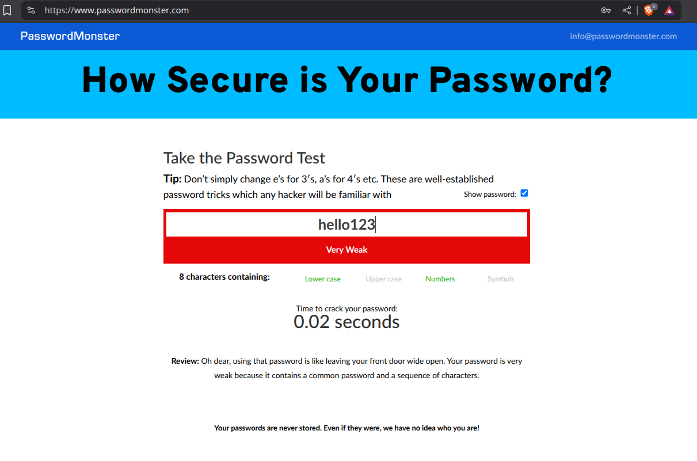
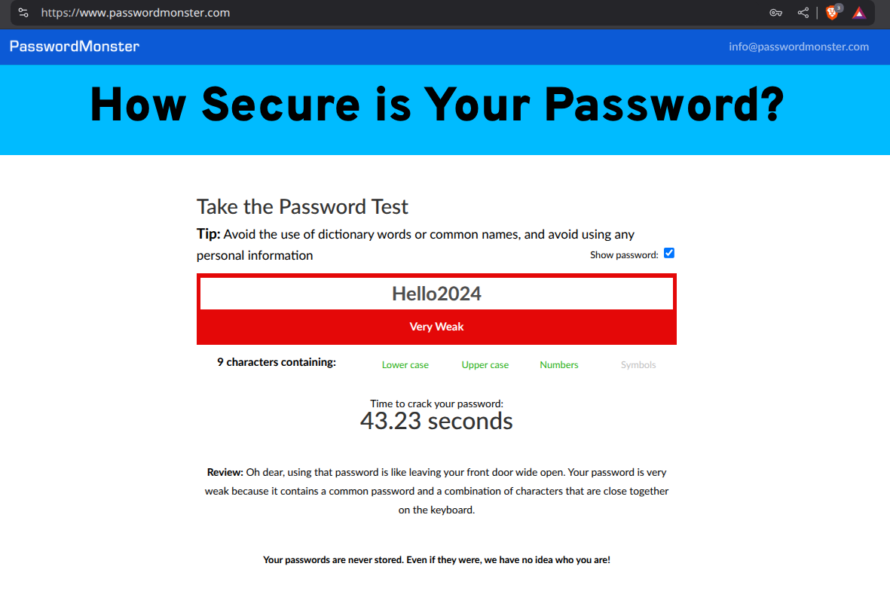
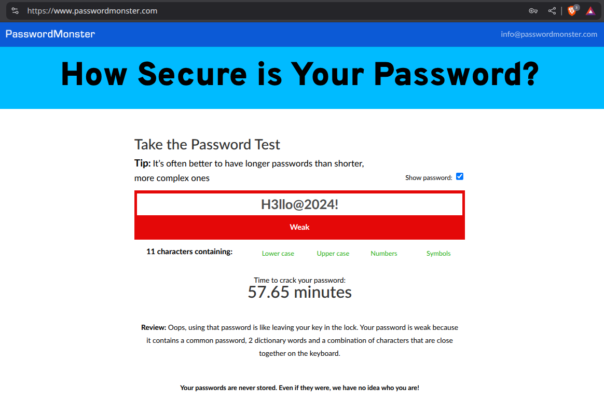
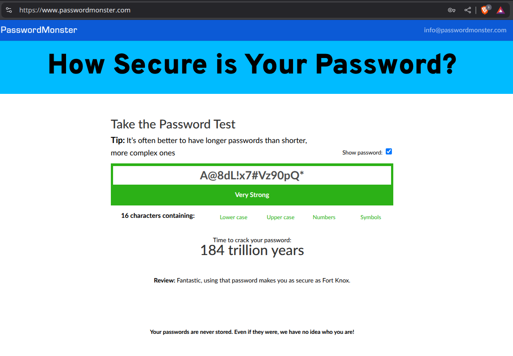
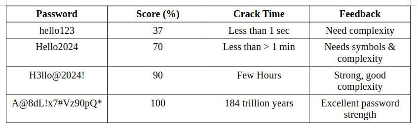

Elevate Labs Internship D06  

Task 6 : Create a Strong Password and Evaluate Its Strength.  

Objective: Understand what makes a password strong and test it against password strength tools.  
Tools: Online free password strength checkers (e.g., passwordmeter.com).  
Deliverables: Report showing password strength results and explanation.  

Step 1: Create Multiple Passwords  

Create at least 4–5 passwords with different characteristics:
- Short: hello123
- Medium: Hello2024
- Strong: H3llo@2024!
- Very strong: A@8dL!x7#Vz90pQ*

Step 2: Use Password Strength Checkers
We are using <a link="https://www.passwordmonster.com">passwordmonster.com</a>  

Step 3: Compare Results  

Tips:
- Use at least 12–16 characters
- Combine upper & lowercase, numbers, and symbols
- Avoid using names, birthdates, dictionary words
- Use passphrases: e.g., Time!To$Learn@Cyber2025
- Use a password manager to store complex passwords

Common Password Attacks:
- Brute force attack – tries every combination
- Dictionary attack – uses a list of common words
- Credential stuffing – uses leaked username/password pairs

Summary:
Password strength depends heavily on length, unpredictability, and complexity. The experiment demonstrated that strong passwords can significantly increase security. Creating unique, long, and complex passwords is essential for making passwords strong.
